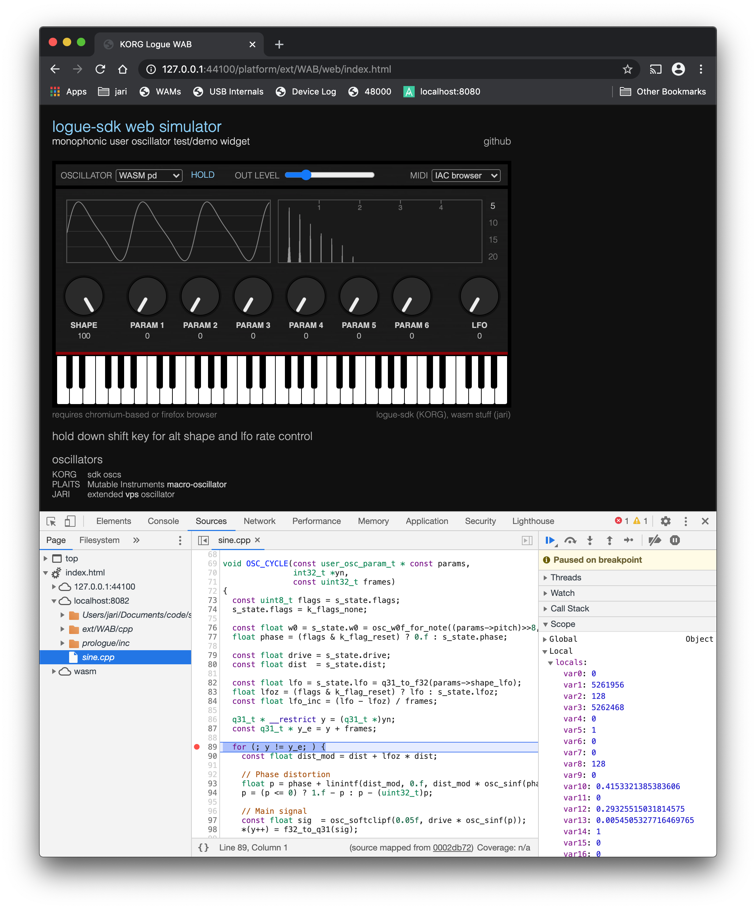

# WebAssembly debugging / demo tool

[online demo](https://webaudiomodules.org/demos/jariseon/logue/)

The goal of the wasm tool is to enable oscillator c++ code debugging, and to provide a web widget for interactive online demoing. An example workflow [here](https://github.com/jariseon/logue-sdk/tree/wasm-demos/platform/wasm) can be adapted for other oscillators as explained below. Once things have been set up, the debugging workflow just requires building (sh build.sh) and a browser page refresh.

## preparation

install emscripten [toolchain](https://github.com/jariseon/logue-sdk/tree/wasm-demos/tools/emscripten)

## building

```
cd platform/wasm
sh build.sh
```

this will produce two files. **pd.js** contains the oscillator wasm code. the shell script moves the file to `web/oscs/test` folder so that the web page can access it. **pd.wasm.map** provides a source map for debugging. it should reside at the root of c++ source tree. therefore, the shell script moves it from the build folder one folder upwards. *Note: when releasing, do not distribute the source map file with your oscillator unless you want to expose your source code.*


## running
serve the files from the `web` folder using a (localhost) server. then open a chromium-based / firefox browser and navigate to http://localhost:port/index.html

defaults for oscillator, overlay visiblity, hold, pitch, frequency range and output level can be defined [here](https://github.com/jariseon/logue-sdk/blob/wasm-demos/platform/ext/WAB/web/index.html#L23-L30). 

## debugging

i've used a second localhost server instance for serving the source map and the associated c++ files, and have been happy with [Web Server for Chrome](https://chrome.google.com/webstore/detail/web-server-for-chrome/ofhbbkphhbklhfoeikjpcbhemlocgigb?hl=en). The important point is that the server's document root needs to be at the root of the source files tree, and that the source map file (e.g., **pd.wasm.map**) needs to reside at its root too. the default port used in the example workflow is 8082. if you want to customize the server setup, modify the `--source-map-base` compiler option [here](https://github.com/jariseon/logue-sdk/blob/wasm-demos/platform/wasm/WASM.mak#L34).

To debug, start the second localhost server and follow the steps listed in **running** section above. Then open chromium's devtools and its Sources tab as shown in the screenshot below. Breakpoints do fire and it is also possible to monitor local variable values. Unfortunately devtools does not yet resolve variable names and structures.

optional: to enable autoplay click on the circled i icon in chrome's address field (see screenshot), and choose *Site Settings* from the menu that appears. Then set *Audio* option to *Allow*.



## adaptation
The most straight-forward way to start developing wasm-enabled logue oscillators is to simply continue building on top of what is in the workflow example folder. However, if you already have a project folder, the list below goes through the required customization steps.

1. copy **WASM.mak** file from the example workflow folder into your project folder. it should be in the same folder where project.mak file is located. Depending on the location of your project folder you may need to edit [these lines](https://github.com/jariseon/logue-sdk/blob/wasm-demos/platform/wasm/WASM.mak#L9-L12) in WASM.mak.

2. copy **build.sh** file to the project folder as well. edit [line 2](https://github.com/jariseon/logue-sdk/blob/wasm-demos/platform/wasm/build.sh#L2) so that it targets the `web/oscs` folder correctly.

3. finally, edit oscillator [descriptor](https://github.com/jariseon/logue-sdk/blob/wasm-demos/platform/ext/WAB/web/logue-synth.js#L8). *code* field should be set to PROJECT.js (as defined in project.mk). *label* is shown in the top bar combobox. *type* allows default oscillator selection in index.html options. *man* defines the target folder under `web/oscs`. Multiple oscillators may be included by adding new descriptor lines.

## improvements
i don't actually own a hardware logue device and have probably missed many important points. suggestions for improved workflows are welcome (just open an issue in this repo).